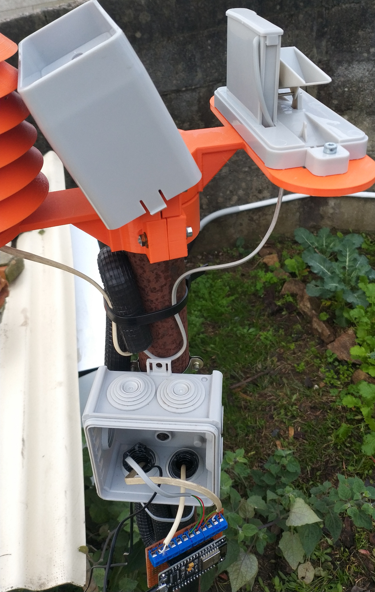
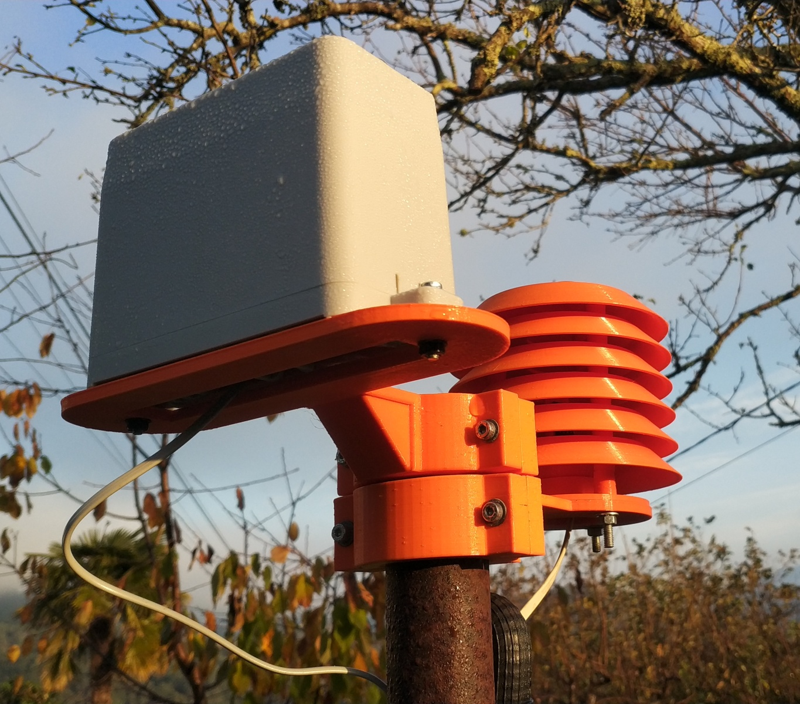
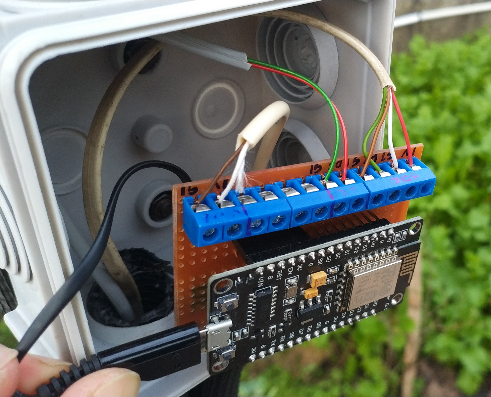

# Estacion meteorolóxica

## Introducción

Esta guía recolle a documentación, código e arquivos necesarios para a construcción e posta en marcha dunha estación meteorolóxica baseada en ESP8266, e polo tanto, comunicada por Wifi coa rede local dunha vivenda.

A estación recibe a alimentación dunha pequena fonte enchufada á rede eléctrica doméstica. O ESP8266 está aloxado nuna caixa estanca estándar para isntalacións eléctricas que cumpriu coa súa función sen problemas por máis dun ano. O código está feito para comunicarse co [servidor MQTT da Raspberri Pi]() que forma parte deste proxecto.

Con esta instalación preténdese:

+ Testear a resistencia dos sensores ante as inclemencias meteorolóxicas (o DHT20 non sobreviveu).

+ Testear a calidade das medidas obtidas no exterior.

+ Probar o funcionamento de sensores que pola súa natureza só poden estar no exterior (pluviómetro, anemómetro, humidade do solo, etc).

+ Enriquecer o conxunto e tipo de datos recibidos no noso sistema IoT.

Neste momento a estación dispón dos seguintes sensores:

+ Un sensor de temperatura e humidade ambiental HDC1080, do que [xa falamos neste documento]() cando o conectamos á RPi. Está aloxado nun [escudo antiradiación](https://www.thingiverse.com/thing:1067700) impreso en PETG que da moi bo resultado.

+ Un [pluviómetro comercial barato](https://es.aliexpress.com/wholesale?catId=0&initiative_id=SB_20210724080447&SearchText=WH-SP-RG) de tipo balancín que fai un reconto dos balanceos provocados pola acumulación de auga nos pequenos depósitos. Tentei

Próximamente engadirei un sensor de chuvia e outro para a humidade do chan. Tamén me gustaría construir un anemómetro de ultrasóns.

## Conexións co ESP8266

## Código

## Para saber máis

+ [5 Things to Consider When Buying and Installing Your New Radiation Shield](https://blog.weathercloud.net/tips-tricks/2016/02/5-things-to-consider-when-buying-and-installing-your-new-radiation-shield/)

+ [Will the BARANI MeteoShield® replace the Stevenson screen as the new reference for climate change measurements?](https://www.baranidesign.com/news-innovations-blog/2018/5/11/what-is-real-air-temperature-and-how-to-measure-it)
